# Next.js + Tailwind Template

**AI-powered development experience** with modern React stack, comprehensive tooling, and intelligent contextual guidance.

## 🚀 **5-Minute Start**

```bash
# Install and setup
npm install && npm run setup-ai

# Start development with live demo
npm run dev

# Visit http://localhost:3000 for interactive examples and onboarding
```

## 🧠 **AI-Powered Development**

This template is **optimized for AI pair programming** with intelligent guidance built-in:

### **Smart Contextual Assistance**

- **📍 File-aware suggestions** - AI understands your current work and suggests relevant patterns
- **🎯 Milestone-based guidance** - Get prompts after completing components, APIs, or major features
- **✨ Feature discovery** - Learn template capabilities exactly when you need them
- **🔧 Quality automation** - Pre-commit hooks catch issues before they reach production

### **Novel Solution Protocol**

When existing patterns aren't enough, the template guides both you and AI through:

1. **Exhaustive exploration** of existing capabilities
2. **Gap analysis** - why current solutions won't work
3. **Compatible extensions** - maintaining architectural consistency
4. **Validation process** for new dependencies or patterns

### **Quick AI Collaboration Examples**

```bash
# Component Development
"What shadcn/ui components work best for this use case?"
"Show me animation patterns for this interaction"
"What accessibility considerations should I add?"

# API Development
"What Zod validation patterns apply here?"
"Show me the error handling approach for this endpoint"
"How should I structure this data mutation?"

# Performance & Quality
"What optimization opportunities exist in this code?"
"Show me the testing patterns for this component type"
"How can I improve the bundle size here?"
```

## 🎯 **What's Included**

**Core Stack**: Next.js 15 • React 19 • TypeScript 5 • Tailwind CSS 3.4  
**UI System**: shadcn/ui components • Radix UI primitives • Lucide icons  
**Animation**: Framer Motion • Embla Carousel • Lenis smooth scroll  
**Data & Forms**: SWR • React Hook Form • Zod validation  
**Quality**: Jest/Testing Library • ESLint/Prettier • Git hooks • AI guidance  
**Production**: Security headers • Performance optimization • SEO utilities

## 📚 **Documentation**

| Resource                                                    | Purpose                                 | Best For                            |
| ----------------------------------------------------------- | --------------------------------------- | ----------------------------------- |
| **[🎯 Developer Onboarding](docs/DEVELOPER_ONBOARDING.md)** | Complete guided walkthrough             | First-time users, learning workflow |
| **[📖 Template Reference](docs/REFERENCE.md)**              | All components, code examples, patterns | Daily development reference         |
| **[🤖 AI Prompting Guide](docs/AI_PROMPTING_EXAMPLES.md)**  | Effective AI assistance prompts         | Getting better AI suggestions       |
| **[🧪 Testing Patterns](docs/testing-patterns.md)**         | Component and API testing examples      | Writing comprehensive tests         |

## 🎯 **Use Cases**

**Perfect For:**

- Modern web applications with rich interactions
- Component libraries and design systems
- Marketing websites with engaging animations
- Dashboards and admin panels
- E-commerce frontends with carousels

**T3 Stack Integration:**

```bash
# For full-stack applications with database/auth
npx create-t3-app@latest my-app --tailwind --nextAuth --prisma

# For frontend-focused projects (this template)
git clone https://github.com/xavstack/Next-Tailwind-template.git
```

## ⚡ **Development Workflow**

```bash
# Quick start commands
npm run dev                    # Start development server
npm test                       # Run tests with coverage
npm run lint                   # ESLint + auto-fix
npm run format                 # Prettier formatting
./scripts/quality/ci-check.sh  # Full quality analysis
```

### Typical Development Flow

```mermaid
graph TD
    A[🚀 Start Project] --> B[npm run dev]
    B --> C{Building Component?}

    C -->|Yes| D[🤖 Ask AI for Guidance]
    D --> E[Check src/components/examples/]
    E --> F[Use shadcn/ui Components]
    F --> G[Implement with TypeScript]

    C -->|API Route| H[📝 Add Zod Validation]
    H --> I[Use SWR for Data Fetching]

    C -->|Styling| J[🎨 Use Tailwind Classes]
    J --> K[Check globals.css for Variables]

    G --> L[✅ Write Tests]
    I --> L
    K --> L

    L --> M[🔧 Pre-commit Hooks Run]
    M --> N{Quality Checks Pass?}

    N -->|No| O[Fix Issues]
    O --> M

    N -->|Yes| P[📤 Commit with Conventional Format]
    P --> Q[🚀 CI/CD Pipeline]
    Q --> R[Deploy to Production]

    style A fill:#e1f5fe
    style D fill:#f3e5f5
    style M fill:#fff3e0
    style R fill:#e8f5e8
```



## 🚀 **AI-First Development**

This template is optimized for **Cursor AI** and similar tools:

- ✅ **Predictable patterns** - Consistent file structure and naming
- ✅ **Type-safe contracts** - Clear interfaces for AI understanding
- ✅ **Live examples** - Working patterns for AI reference
- ✅ **Quality automation** - Automatic error catching and formatting
- ✅ **Contextual guidance** - Smart suggestions based on current work

**How it works**: AI observes your file context → suggests relevant template features → guides implementation → quality tools ensure correctness.

## 🔧 Customization

### Adding New Technologies

The template is designed for extensibility. Common additions:

```bash
# Database & ORM
npm install prisma @prisma/client

# Authentication
npm install next-auth

# State Management
npm install zustand

# Additional UI Components
npx shadcn@latest add [component-name]
```

### Styling Customization

Modify `tailwind.config.ts` and `src/app/globals.css` for:

- Custom color schemes
- Typography scales
- Component variants
- Animation presets

## 🌟 Live Demo

Visit the [live demo](https://your-demo-url.vercel.app) to see all features in action, including:

- Interactive component showcase
- Animation examples
- Form implementations
- Theme switching
- Responsive design patterns

## 📄 License

MIT License - see [LICENSE](LICENSE) file for details.

---

**Built with ❤️ for the modern React ecosystem**
